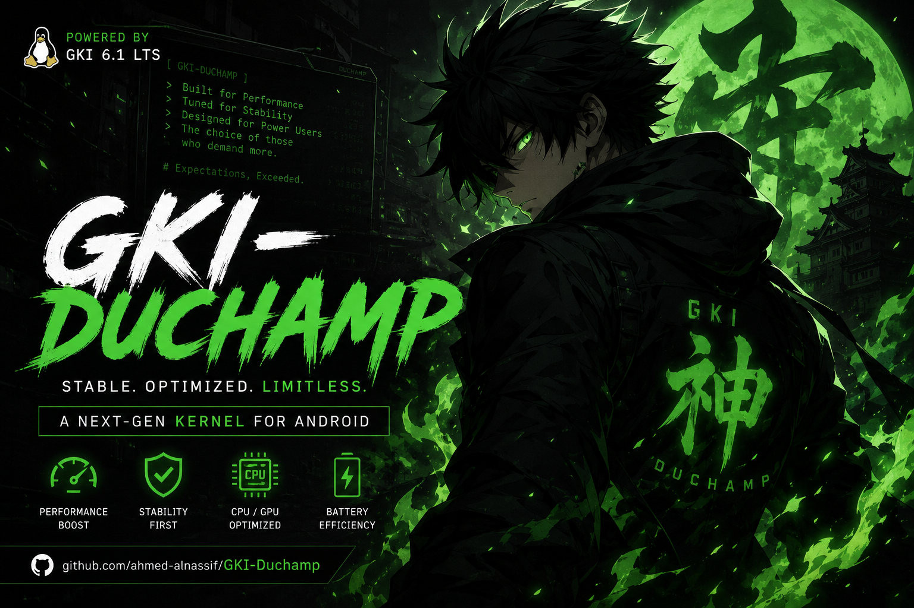

# AHK-Fire Kernel Pixel

  

A feature-rich Generic Kernel Image (GKI) kernel built for the **Google Pixel 6 Pro** and compatible with any device running a **6.1.xx-android14** GKI kernel. Designed to offer maximum flexibility, it provides multiple variants to suit your specific needs, whether you prioritize root management, system integrity, or performance.

## Key Features

*   **Performance & Efficiency Tweaks:** Extensively optimized for Google Pixel 6 Pro (and similar 6.1.xx-android14 devices):

    - Timer frequency set to **300Hz** for noticeably lower input lag and snappier feel
    - **Multi-Gen LRU (MGLRU)** enabled for better multitasking and battery efficiency
    - **Optimized memory operations** (memcpy, memcmp, memset) from ARM-optimized-routines for up to 50% faster string/memory handling
    - **3x faster integer square root** reducing CPU time in cpufreq calculations
    - Optimized **zRAM** with LZ4 compression + writeback + tracking for more and faster usable RAM under heavy loads
    - CPU governors: **schedutil + ondemand** for efficient yet responsive scaling
    - **mq-deadline I/O scheduler** tuned for low latency on UFS 4.0 storage
    - Network stack with **TCP BBRv3** + **TCP Westwood+** + **FQ** + **ECN** + **IPv6 HL support** for reduced latency and faster WiFi/mobile data speeds
    - **F2FS** filesystem tuning (reduced GC sleep to 50ms, enlarged fsync blocks, reduced congestion timeout)
    - **ext4** commit age extended to 30s for fewer disk writes
    - **IP Set** full support + **IPv6 NAT** for better tethering and VPN performance
    - **Filesystem Unicode fix** preventing crashes from invalid UTF-8 filenames on vfat/exfat
    - **NTSync driver** for significantly faster Windows games/apps on Winlator & GameHub

*   **Battery & Power Optimizations:**
    - Freeze timeout reduced from 20s to **1s** for faster deadlock detection
    - Global wakelock timeout capped at **500ms** to prevent infinite battery drain
    - Alarmtimer wakeup minimized using actual timer values instead of hardcoded 2s
    - Excessive s2idle wake attempts eliminated (single wake instead of multiple)
    - PCI PME check interval extended to reduce unnecessary wakeups
    - VFS cache pressure reduced to **50** for better RAM utilization
    - Cache hot buddy disabled for DynamIQ Shared Unit efficiency

*   **Scheduler & CPU Optimizations:**
    - CPU scan order adjusted for efficient idle core selection
    - Branch prediction hints optimized in cpufreq paths
    - File struct aligned to 8 bytes for better cache performance
    - Clear page aligned to 16 bytes reducing CPU time on page allocation
    - Memory prefetch optimizations for copy operations

*   **Kali NetHunter:** Full support enabled (monitor mode, packet injection, rtw88 driver). Matching **WirelessKSU** modules are provided for every variant.

*   **DroidSpaces:** Full kernel support enabled for [DroidSpaces](https://github.com/ravindu644/Droidspaces-OSS) a lightweight container runtime that lets you run real Linux distributions (Ubuntu, Debian, etc.) with proper isolation and init systems (systemd/OpenRC) directly on your Android device.

*   **Multiple Variants:** Choose the configuration that fits your needs:
    - **Root solutions:** KernelSU, KernelSU Next, SukiSU-Ultra, or Vanilla (no root)
    - **Manager flexibility:** Multiple-Manager variants let you use your preferred manager app
    - **LTO options:** thinLTO builds + dedicated `+NoLTO` / `Compat+NoLTO` variants

*   **SUSFS Integration:** Advanced kernel-level hiding and spoofing capabilities (available in dedicated variants)
*   **Baseband Guard (BBG):** Lightweight LSM that blocks unauthorized writes to critical partitions and device nodes, protecting the baseband and boot chain from tampering

## Support the Development

If you find this kernel useful, consider showing your support:

*   **Star the Repository:** Give this project a star on GitHub to help others discover it
*   **Share:** Spread the word in your community, forums, or with fellow Google Pixel 6 Pro users
*   **Report Issues:** Found a bug? Open an issue with detailed logs to help improve stability
*   **Contribute:** Pull requests, suggestions, and constructive feedback are always welcome

Your support helps keep this project maintained and improved for everyone.

## Recommended Modules for Google Pixel 6 Pro

Enhance your device with these companion modules:

| Module | Description |
|--------|-------------|
| [**GPU Unlocker**](https://github.com/ahmed-alnassif/GPU-Unlocker) | Unlock the Mali-G615 MC6 GPU from 701 MHz to full 1.4 GHz on Pixel 6 Pro. |
| [**Thermal Manager**](https://github.com/ahmed-alnassif/Thermal-Manager) | Fixes the thermal mode/profile reset issue on Pixel 6 Pro. Monitor and force-persist your chosen mode: **Balanced**, **Battery Saver**, **Performance**, or **Gaming**. Includes **WebUI** for instant switching, auto battery saver when screen off, and mode persistence after reboot. |
| [**DSP AudioFix**](https://github.com/ahmed-alnassif/DSP-AudioFix) | Simple fix for distorted audio on Google Pixel 6 Pro and similar devices with Awinic smart amps. |

>[!TIP]
>Both modules are designed specifically for Google Pixel 6 Pro hardware quirks and work seamlessly with any AHK-Fire kernel variant.

## Compatibility
*   **Primary Device:** Google Pixel 6 Pro

*   **GKI Requirement:** Flashes on any device with a **6.1.xx-android14** kernel.  
    *(Note: Only tested on the Google Pixel 6 Pro. Please exercise caution on other devices.)*

## Downloads
Find the latest builds for all variants in the [Releases](https://github.com/ahksoft/AHK-Fire_kernal_Pixel/releases) section.

## Kernel Source
**GitHub:** [ahksoft/AHK-Fire_kernal_Pixel](https://github.com/ahksoft/AHK-Fire_kernal_Pixel)
